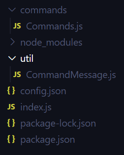
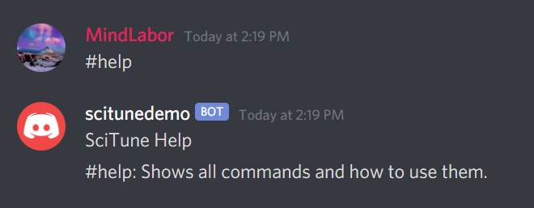

In the last lesson, we have created a simple bot that logs a message into the console. Now, we need to make some form of logic that identifies a command and executes it. Create a new folder "util" in your project and add the file CommandMessage.js. We are going to use this file to handle commands and messages. Create another folder named "commands" and add the file Commands.js. Your file structure should look like this:



Go ahead and create the class CommandMessage in CommandMessage.js. This class takes the message and should be able to validate if it is a valid command. A valid command is not sent by the bot itself and begins with the prefix specified in the config.json file. The *toString* method returns the message as a string.
```js
/* util/CommandMessage.js */
const { PREFIX } = require("../config.json");

class CommandMessage {
	constructor(message) {
		this.message = message;
		this.parsedMessage = this.parse(); // Is used later in the lesson
	}

	/* Get the message as a string */
	toString() {
		return this.message.content.trim();
	}

	/* Returns true if the message was not sent by a bot
			 and it started with the prefix */
	isValid() {
		return !this.message.author.bot && this.toString().startsWith(PREFIX);
	}

	/* Get text channel of message (for sending messages to it) */
	getTextChannel() {
		return this.message.channel;
	}
}

module.exports = CommandMessage;
```

If the bot has validated that the message is a command, it must know which command to execute and with what arguments. Arguments are separated by spaces so we can easily split the command. The *parse* method returns an object that holds the actual command string and an array with its arguments.

```js
/* util/CommandMessage.js */
parse() {
	let message = {};
	let messageString = this.toString();

	// Replace multiple spaces and whitespace with one space to 
	// prevent empty arguments when splitting by a space
	messageString = messageString.replace(/\s+/g, " ");

	// If command has arguments: split command into "command" and "arguments"
	if (messageString.includes(" ")) {
		const firstArgSeparator = messageString.indexOf(" ");

		message.command = messageString.substring(PREFIX.length, firstArgSeparator);
		message.arguments = messageString.substring(firstArgSeparator + 1).trim().split(" ");
		return message;
	}

	message.command = messageString.substring(PREFIX.length);
	message.arguments = [];
	return message;
}
```
Now that we know which command was sent, we need to run the logic that corresponds to it. Here comes the commands folder into play. For managing and maintaining all the different commands, it is essential to have a clear structure. Let's add our first help command by creating a new file help.js in the commands folder that exports a function. This function needs a CommandMessage object to access the message and other data like the text channel and author of it.
```js
/* commands/help.js */
const { PREFIX } = require("./../config.json");

module.exports = async function(command) {
    const textChannel = command.getTextChannel();
    textChannel.send("SciTune Help");
    textChannel.send(`${PREFIX}help: Shows all commands and how to use them.`);
}
```

The Commands.js file takes all command files and puts them together in one object with other command-specific data. In this case, it takes the help function and adds aliases to it, so there are multiple ways of writing a command (#help, #h, #command, #commands).
```js
/* commands/Commands.js */
const help = require("./help");

module.exports = [{
	aliases: ["help", "h", "command", "commands"],
	execute: help
}]
```

Add the following code into your CommandMessage class, and don't forget to import the Commands.js file using `const Commands = require("../commands/Commands.js");`.
```js
/* util/CommandMessage.js */

/* Get the command data of the current command specified in Commands.js */
getCommand() {
	return Commands.find(c => c.aliases.includes(this.parsedMessage.command));
}

/* Execute the command */
execute() {

	// If there is no such command return
	const command = this.getCommand();
	if (!command) {
		console.error("Command not found");
		return;
	}

	// Execute command and pass the current object to it
	command.execute(this);
}
```
The execute method fetches the command data from Commands.js and executes the command using its function. Finally, modify the index.js file so that the CommandMessage is used to validate and execute our command.
```js
const CommandMessage = require("./util/CommandMessage"); // At the top

client.on("message", message => {
    const command = new CommandMessage(message);
	if (command.isValid()) command.execute();
});
```
The execute method fetches the command data from Commands.js and executes the command using its function. Finally, modify the index.js file so that the CommandMessage is used to validate and execute our command.



At the moment, it's not very pretty. In the next lesson, we will look at embeds to make the bot's response more appealing.