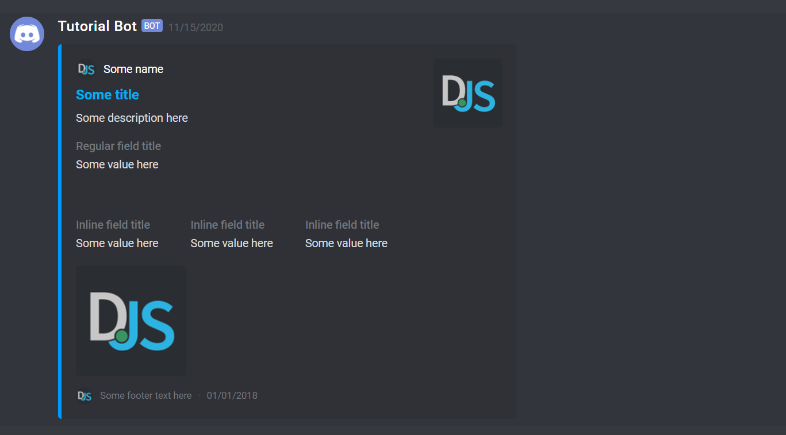
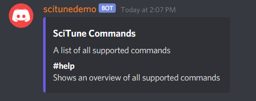

Currently, we are sending multiple messages to show all commands when using #help. But there is a much better and more appealing way to do this. Using discords embeds you can format your messages and include images and colors:



So let's create our embed for the #help command. Since we will be using alot of different embeds throughout this project, we should create a class to make things easier for us. 


```js
const Discord = require("discord.js");

/**
 * This class is used to communicate to the user using <Discord.MessageEmbed>. It makes it easier
 * to reuse messages and keep the code much simpler.
 */
class Communication {

	constructor(textChannel) {
		this.textChannel = textChannel;
	}

}

module.exports = Communication;
```

The constructor takes the parameter textChannel to let the class know in which channel an embed should be sent. Before writing the method that sends the embed, add the description key to the commands in Commands.js:

```js
module.exports = [{
    name: "help",
    aliases: ["help", "h", "command", "commands"],
    description: "Shows an overview of all supported commands"
}]
```

Now that we have the descriptions in Commands.js it is easier to introduce new commands without modifing the code. Add the following method in the Communication class:

```js
help() {

	// Create the embed with its color, title and description
	const embed = new Discord.MessageEmbed()
			.setColor("#6c5ce7")
			.setTitle("SciTune Commands")
			.setDescription("A list of all supported commands");

	// Add a field for every command with its description
	for (const command of Commands)
		embed.addField(Config.PREFIX + command.aliases[0], command.description);
	
	// Send the embed
	this.textChannel.send(embed);
}
```

At last, modify the help.js file to use the Communication class:
```js
module.exports = async function(command) {
    const textChannel = command.getTextChannel();
    const sender = new Communication(textChannel);
    sender.help();
}
```

The result should look like this:

